# WE-Vanta

A web wallpaper that allows you to use VantaJS inside wallpaper engine.

## Download
[Download the latest official build from steam.](https://steamcommunity.com/sharedfiles/filedetails/?id=TODO)  
If you want to use the latest source, `git clone` the project and manually import it (see section Testing).

## Development
Development is quite simple, all you need to do is start a web server and visit the url that represents the `index.html` file.
I used VSCode to develop this extension, so I installed [Live Server](https://marketplace.visualstudio.com/items?itemName=ritwickdey.LiveServer) and ran it through there. This gives you automatic reloads when changes happen.

## Testing
To test the project and any changes you made, open Wallpaper Editor and import the `index.html` file.

## Production build
To keep the build size small, the following files and folders will be removed on build:  
- `.git/`  
- `.media/`  
- `.vscode/`  
- `.prettierrc`  
- `README.md`  

## Options (aka Properties)
| Name | Description | Default Value |
|-|-|-|
| Effect | The currently selected effect. | Fog |

## Effects
### [Fog](https://www.vantajs.com/?effect=fog)

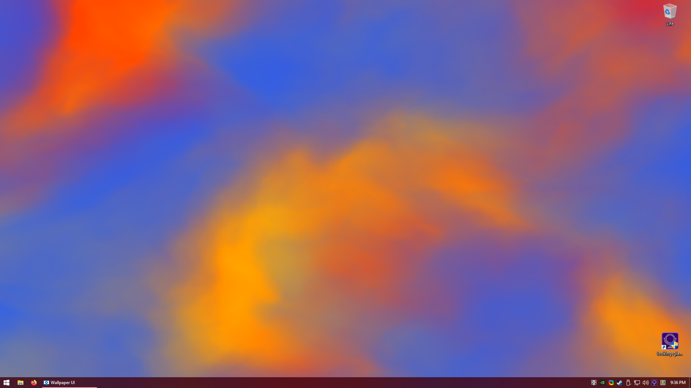
| Name | Description | Default Value |
|-|-|-|
| Base Color |  | `1 0.9215686274509803 0.9215686274509803` |
| Blur Factor |  | `0.6` |
| Highlight Color |  | `1 0.7647058823529411 0` |
| Midtone Color |  | `1 0.12156862745098039 0` |
| Lowlight Color |  | `0.17647058823529413 0 1` |
| Speed |  | `1` |
| Zoom |  | `1` |

### [Waves](https://www.vantajs.com/?effect=waves)

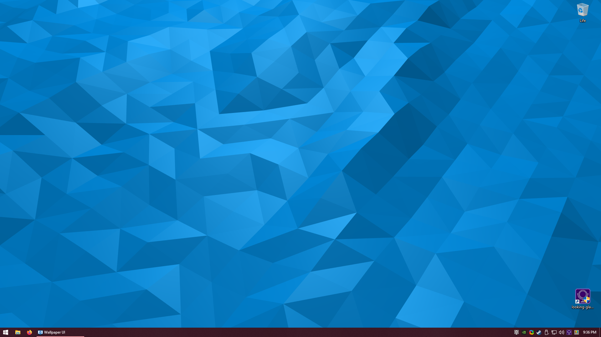
| Name | Description | Default Value |
|-|-|-|
| Color |  | `0.3333333333333333 0.5333333333333333 1` |
| Shininess |  | `30` |
| Wave Height |  | `15` |
| Wave Speed |  | `1` |
| Zoom |  | `1` |

### [Cells](https://www.vantajs.com/?effect=cells)

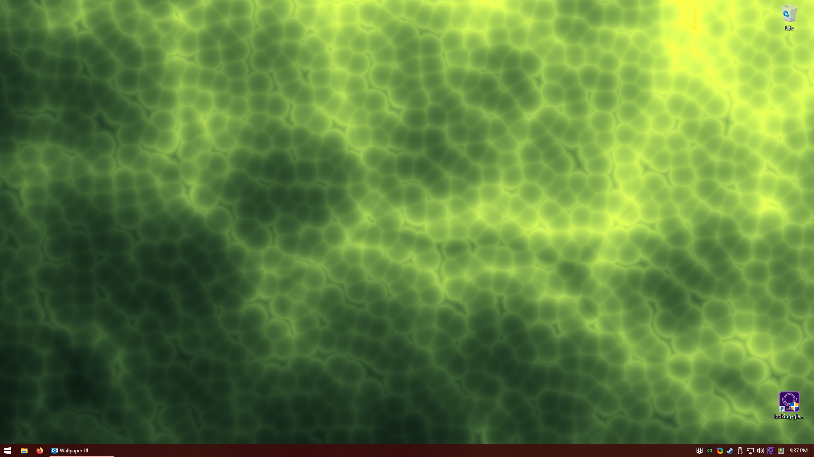
| Name | Description | Default Value |
|-|-|-|
| Color 1 |  | `0.5490196078431373 0.5490196078431373 0.4627450980392157` |
| Color 2 |  | `0.9490196078431372 0.9058823529411765 0.20784313725490197` |
| Size |  | `1` |
| Speed |  | `1` |

### [Clouds](https://www.vantajs.com/?effect=clouds)

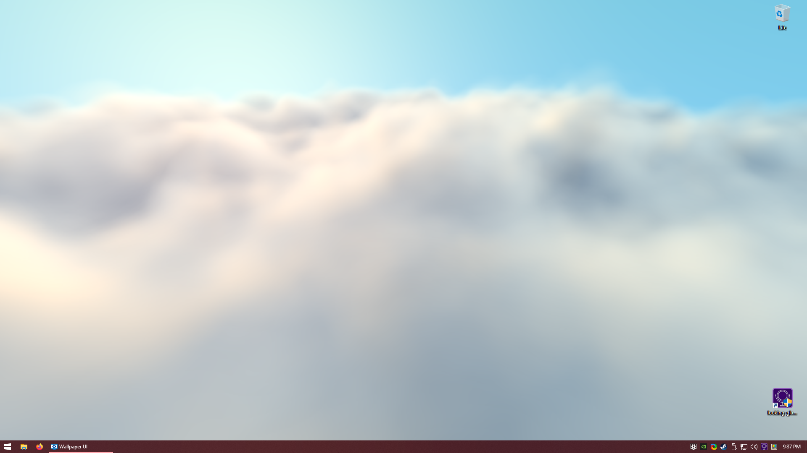
| Name | Description | Default Value |
|-|-|-|
| Background Color |  | `1 1 1` |
| Cloud Color |  | `0.6784313725490196 0.7568627450980392 0.8705882352941177` |
| Cloud Shadow Color |  | `0.09411764705882353 0.20784313725490197 0.3137254901960784` |
| Sky Color |  | `0.40784313725490196 0.7215686274509804 0.8431372549019608` |
| Speed |  | `1` |
| Sun Glare Color |  | `1 0.4 0.2` |
| Sunlight Color |  | `1 0.6 0.2` |

### [Birds](https://www.vantajs.com/?effect=birds)

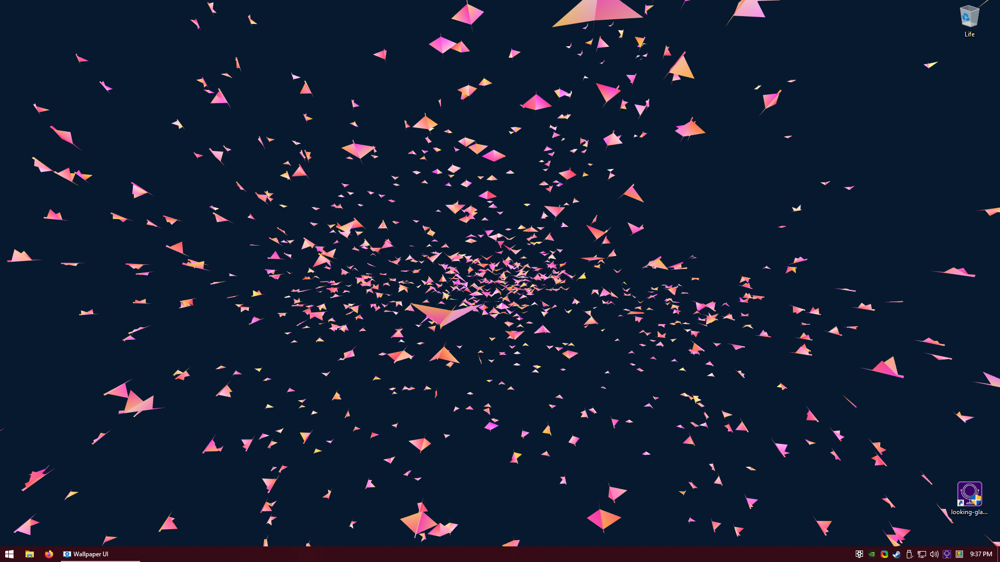
| Name | Description | Default Value |
|-|-|-|
| Alignment |  | `20` |
| Background Alpha |  | `1` |
| Background Color |  | `0.7333333333333333 0.050980392156862744 0.050980392156862744` |
| Bird Size |  | `1` |
| Cohesion |  | `1` |
| Color 1 |  | `1 0 0` |
| Color 2 |  | `0.09411764705882353 0.7294117647058823 0.7058823529411765` |
| Color Mode |  | `Variance Gradient` |
| Quantity |  | `1` |
| Separation |  | `4` |
| Speed Limit |  | `3` |
| Wing Span |  | `15` |

### [Net](https://www.vantajs.com/?effect=net)

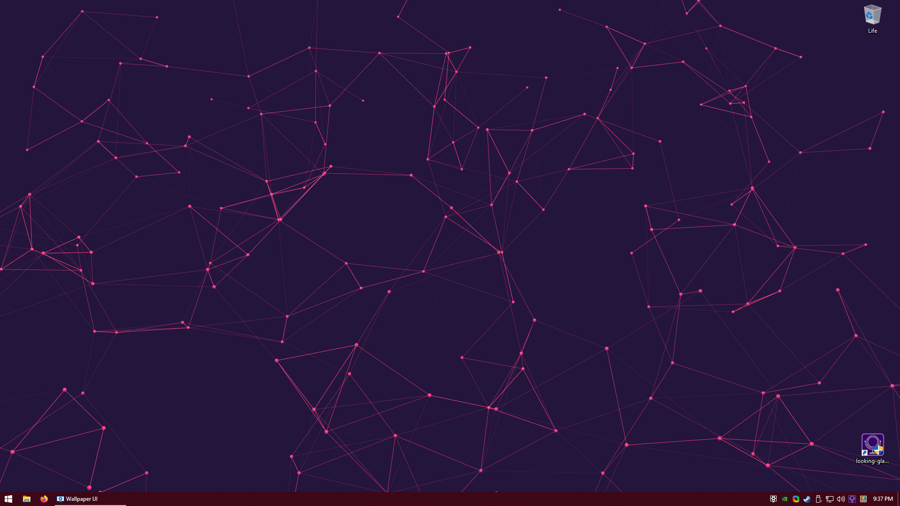
| Name | Description | Default Value |
|-|-|-|
| Background Color |  | `0.13725490196078433 0.08235294117647059 0.23529411764705882` |
| Color |  | `1 0.24705882352941178 0.5058823529411764` |
| Max Distance |  | `15` |
| Points |  | `1` |
| Show Dots |  | true _(checked)_ |
| Spacing |  | `10` |

### [Globe](https://www.vantajs.com/?effect=globe)

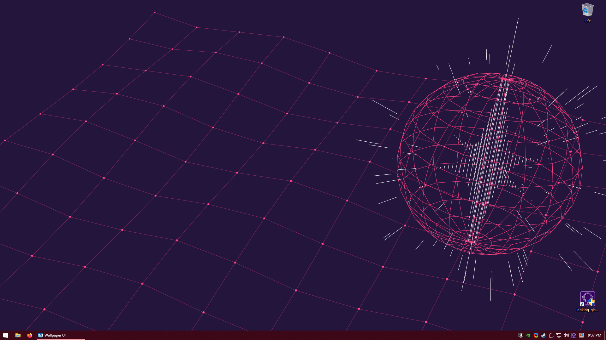
| Name | Description | Default Value |
|-|-|-|
| Background Color |  | `0.19215686274509805 0.19215686274509805 0.011764705882352941` |
| Color |  | `0 0.5137254901960784 1` |
| Color 2 |  | `0.8509803921568627 0 1` |
| Size |  | `1` |

### [Rings](https://www.vantajs.com/?effect=rings)

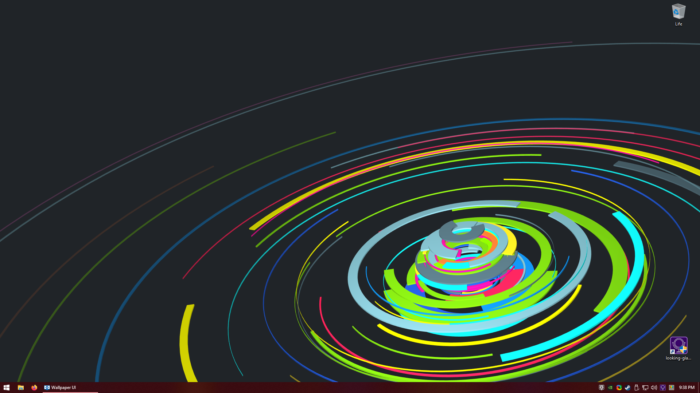
| Name | Description | Default Value |
|-|-|-|
| Background Alpha |  | `1` |
| Background Color |  | `0.12549019607843137 0.1411764705882353 0.1568627450980392` |
| Color |  | `0.5333333333333333 1 0` |

### [Halo](https://www.vantajs.com/?effect=halo)

| Name | Description | Default Value |
|-|-|-|
| Amplitude Factor |  | `1` |
| Background Color |  | `0.07450980392156863 0.10196078431372549 0.2627450980392157` |
| Base Color |   | `0.10196078431372549 0.34901960784313724 1` |
| Size |  | `1` |
| X Offset |  | `0` |
| Y Offset |  | `0` |

## Not implemented / wrong or broken implementation
- Ripple [Implemented, though non-customizable]
  - This effect seems to be undocumented and unreleased. Whilst the effect itself has been implemented in WE-Vanta; options are not.
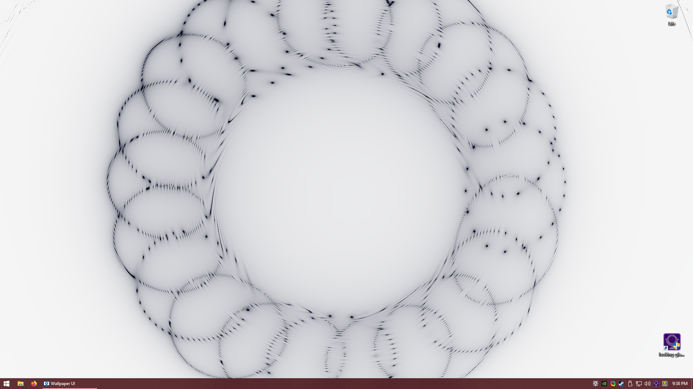

- [Dots](https://www.vantajs.com/?effect=dots) _[Implemented, though non-customizable]_
  - After initialization, variables cannot be changed for some reason. Will investigate.
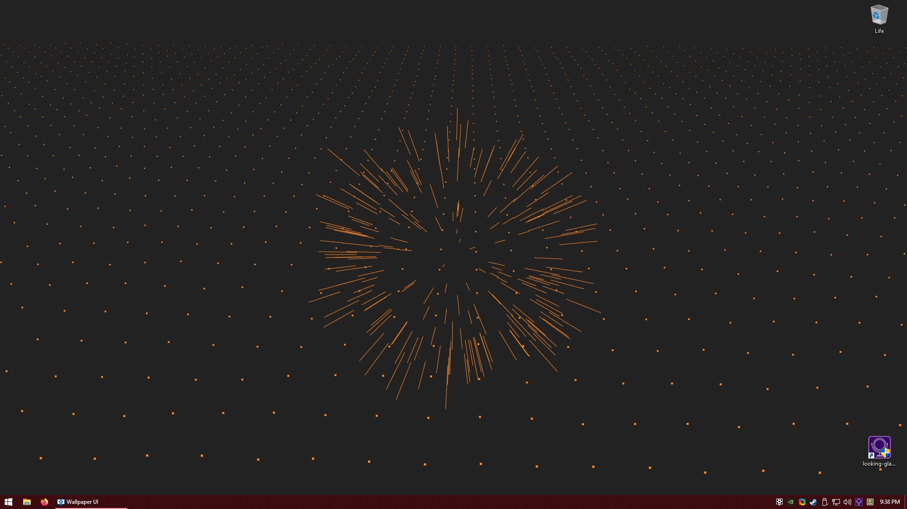

- [Clouds 2](https://www.vantajs.com/?effect=clouds2) _[Implemented, invalid output]_
  - Requires a texture/noise path, which cannot be provided after initialization. Will be resolved in the future.
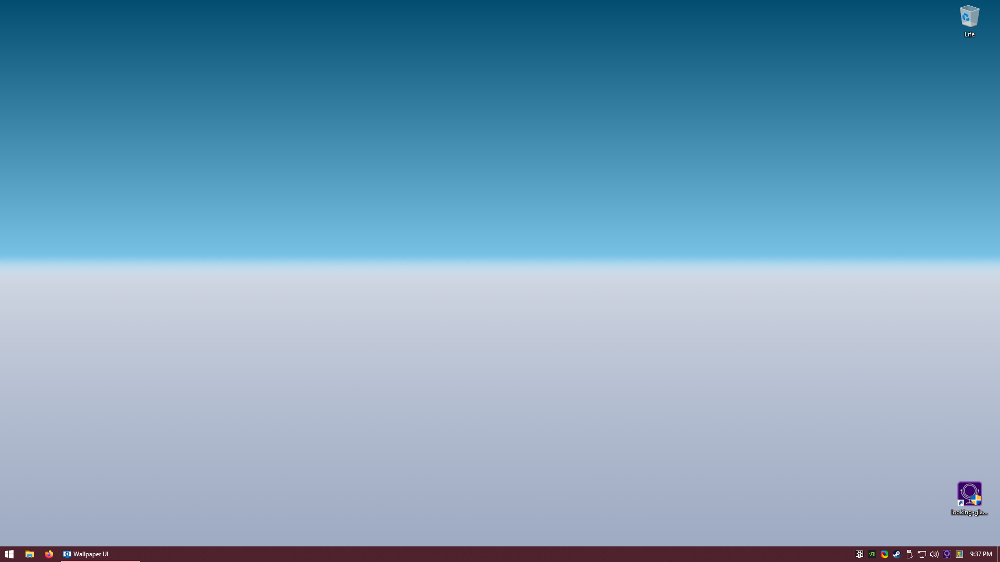

- [Trunk](https://www.vantajs.com/?effect=trunk) _[Partly implemented]_
  - Causes an error when loading in due to a constructor mismatch. Will be resolved in the future.

- [Topology](https://www.vantajs.com/?effect=topology) _[Partly implemented]_
  - Causes an error when loading in due to a constructor mismatch. Will be resolved in the future.